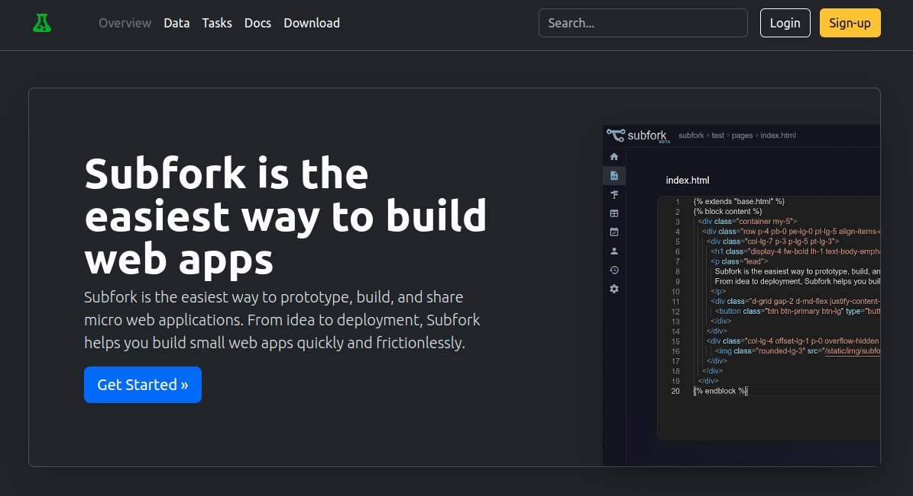

# TEST.FORK.IO

This site is running live at [test.fork.io](https://test.fork.io). Built and hosted on [subfork.com](https://subfork.com).

Author: ryan@rsg.io



Start by cloning the source code. 

```bash
$ git clone https://github.com/subforkdev/test.fork.io
```

#### Create a site

After [creating a new site](https://docs.subfork.com/creating-your-site/) on [subfork.com](https://subfork.com), change the domain value
in the `subfork.yml` file to the domain of your new site:

```yaml
domain: <domain>
```

Add Subfork [API keys](https://docs.subfork.com/creating-your-site/#api-keys)
to the environment or the `default.env` file:

```bash
$ export SUBFORK_ACCESS_KEY=<access key>
$ export SUBFORK_SECRET_KEY=<secret key>
```

#### Run locally

```bash
$ subfork run
```

#### Deploy

```bash
$ subfork deploy -c <comment> --release
```

## Installation

Use the Makefile to build dependencies:

```shell
$ make build
```

#### Environment

Environment variables are managed using envstack in `default.env` file.
Secrets are stored in the `secrets.env` file and encrypted using AES-GCM
encryption, and can be safely committed to the repo.

```shell
$ ./default.env
```

#### Testing

To test running the service using the `test.env` environment:

```shell
$ ./test.env -- subfork worker
```

### Quickstart

To install and start the systemd service:

```shell
$ make install
$ make start
```

Get a list of installed versions:

```shell
$ envstack test -- distman -s [-t <target>]
```

To deploy the app to subfork:

```shell
$ make deploy
```

### Workers

Checking systemd worker logs:

```shell
$ sudo journalctl -u test.fork.io -f
```